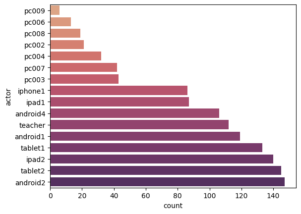

# xapi_analysis

<!-- WARNING: THIS FILE WAS AUTOGENERATED! DO NOT EDIT!!! -->

This library provides the functions necessary to import and process xAPI
statements, whether they are provided as `JSON` or `csv` files.

The [documentation](https://stocastico.github.io/xapi_analysis/) of the
library provides tests and examples for the function, and it can be used
as the starting point for analysing xAPI statements datasets.

## Install

``` sh
pip install git+https://github.com/stocastico/xapi_analysis.git
```

## How to use

After installing, import the modules in your Python code using the
following calls

``` python
from xapi_analysis.input_json import *
from xapi_analysis.input_csv import *
```

And from there you can use all the functions defined there.

### Example

As an example, let’s just open a toy dataset of xAPI statements and run
some functions on it

``` python
csv_file = '../example_statements_4.csv'
statements = import_csv(csv_file, index_col=0, delimiter=',')
statements.head(5)
```

<div>
<style scoped>
    .dataframe tbody tr th:only-of-type {
        vertical-align: middle;
    }
&#10;    .dataframe tbody tr th {
        vertical-align: top;
    }
&#10;    .dataframe thead th {
        text-align: right;
    }
</style>

|     | timestamp                        | stored                   | actor   | verb      | object     | result              |
|-----|----------------------------------|--------------------------|---------|-----------|------------|---------------------|
| 0   | 2023-03-10 11:45:09.638000+00:00 | 2023-03-10T11:45:09.638Z | Teacher | Logged In | Salesianos | NaN                 |
| 1   | 2023-03-10 11:52:00.020000+00:00 | 2023-03-10T11:52:00.020Z | PC006   | Logged In | Salesianos | NaN                 |
| 2   | 2023-03-10 11:52:04.063000+00:00 | 2023-03-10T11:52:04.063Z | PC008   | Logged In | Salesianos | NaN                 |
| 3   | 2023-03-10 11:52:05.177000+00:00 | 2023-03-10T11:52:05.177Z | Tablet1 | Logged In | Salesianos | {"score":{"raw":0}} |
| 4   | 2023-03-10 11:52:05.679000+00:00 | 2023-03-10T11:52:05.679Z | PC004   | Logged In | Salesianos | NaN                 |

</div>

Process and filter the data:

``` python
statements = remove_whitespaces(statements, ["actor"])
statements = to_lowercase(statements, ["actor"])
statements = remove_verbs(statements, ["Logged In", "Logged Out"])
statements = remove_actors(statements, ["android3"])
statements.head(5)
```

<div>
<style scoped>
    .dataframe tbody tr th:only-of-type {
        vertical-align: middle;
    }
&#10;    .dataframe tbody tr th {
        vertical-align: top;
    }
&#10;    .dataframe thead th {
        text-align: right;
    }
</style>

|     | timestamp                        | stored                   | actor    | verb   | object | result              |
|-----|----------------------------------|--------------------------|----------|--------|--------|---------------------|
| 14  | 2023-03-10 11:52:18.277000+00:00 | 2023-03-10T11:52:18.277Z | iphone1  | Placed | Earth  | {"score":{"raw":0}} |
| 15  | 2023-03-10 11:52:18.847000+00:00 | 2023-03-10T11:52:18.847Z | iphone1  | Swiped | Left   | {"score":{"raw":0}} |
| 18  | 2023-03-10 11:52:29.001000+00:00 | 2023-03-10T11:52:29.001Z | iphone1  | Placed | Earth  | {"score":{"raw":0}} |
| 19  | 2023-03-10 11:52:29.094000+00:00 | 2023-03-10T11:52:29.094Z | android2 | Placed | Earth  | {"score":{"raw":0}} |
| 20  | 2023-03-10 11:52:29.194000+00:00 | 2023-03-10T11:52:29.194Z | iphone1  | Swiped | Right  | {"score":{"raw":0}} |

</div>

Count the number of statements sent by each actor

``` python
interactions =  count_interactions(statements)
interactions
```

<div>
<style scoped>
    .dataframe tbody tr th:only-of-type {
        vertical-align: middle;
    }
&#10;    .dataframe tbody tr th {
        vertical-align: top;
    }
&#10;    .dataframe thead th {
        text-align: right;
    }
</style>

|     | actor    | count |
|-----|----------|-------|
| 0   | pc009    | 6     |
| 1   | pc006    | 13    |
| 2   | pc008    | 19    |
| 3   | pc002    | 21    |
| 4   | pc004    | 32    |
| 5   | pc007    | 42    |
| 6   | pc003    | 43    |
| 7   | iphone1  | 86    |
| 8   | ipad1    | 87    |
| 9   | android4 | 106   |
| 10  | teacher  | 112   |
| 11  | android1 | 119   |
| 12  | tablet1  | 133   |
| 13  | ipad2    | 140   |
| 14  | tablet2  | 145   |
| 15  | android2 | 147   |

</div>

``` python
create_barplot(interactions, 'count', 'actor', cmap='flare')
```


